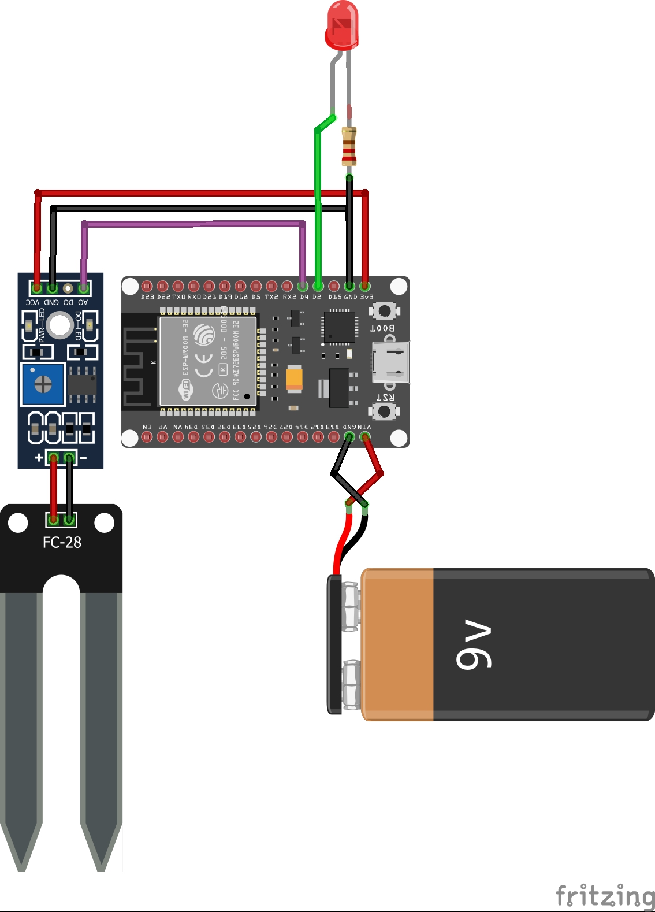

# Sistema de Alerta de Irrigação com ESP32 e MQTT

Sistema de alerta de irrigação baseado em ESP32, sensor de umidade de solo e LED indicador. Monitoramento em tempo real via MQTT, permitindo o acompanhamento remoto da umidade do solo e acionamento automático de alerta visual para irrigação manual.

---

## Visão Geral

Este projeto monitora continuamente a umidade do solo usando um sensor HL-69 acoplado a um ESP32. Sempre que a umidade fica abaixo do limiar, um LED é acionado automaticamente para alertar o usuário sobre a necessidade de irrigação. Os dados de umidade são publicados em um broker MQTT para monitoramento remoto via dashboards, aplicativos ou MQTT Explorer.

---

## Funcionamento e Uso

1. **Monte o circuito:**  
   - Sensor HL-69: Sinal no GPIO 34, VCC no 3.3V e GND no GND do ESP32.
   - LED: Ânodo no GPIO 2 (via resistor 220Ω) e cátodo no GND.
2. **Configure a rede Wi-Fi e o broker MQTT** no arquivo `.ino`.
3. **Faça o upload do código** para o ESP32 usando a Arduino IDE.
4. **Monitore os dados publicados** em tempo real no tópico MQTT `irrigador/umidade`.
5. O LED acende automaticamente quando a planta precisa de irrigação.

---

## Software

- **Principais arquivos:**
    - `ProjetoIrrigadorOO.ino`: código principal.
    - `SensorUmidade.cpp`/`.h`: leitura do sensor HL-69.
    - `AtuadorLED.cpp`/`.h`: controle do LED.
    - `GerenciadorIrrigacao.cpp`/`.h`: lógica de decisão.
    - `ComunicadorMQTT.cpp`/`.h`: publicação dos dados MQTT.
- O código está comentado.

---

## Hardware

- ESP32 DevKit v1
- Sensor de umidade HL-69
- LED comum + resistor 220 Ω
- Jumpers (fêmea-fêmea)
- Fonte 9V (ou USB)

---

## Comunicação e Protocolos

- **MQTT:**  
  - Broker recomendado: Mosquitto, HiveMQ ou similar.
  - Tópico de publicação: `irrigador/umidade` (sensor), `estado/led` (opcional).
  - Porta padrão: 1883 (TCP/IP).
- **Wi-Fi:** conexão local via biblioteca WiFi.h.
- **Monitoramento:** compatível com MQTT Explorer, Node-RED, Home Assistant, etc.
- **Controle do LED é totalmente automático** — sem comandos remotos.

---

## Requisitos

- Rede Wi-Fi ativa
- Broker MQTT acessível
- Arduino IDE para upload do firmware

